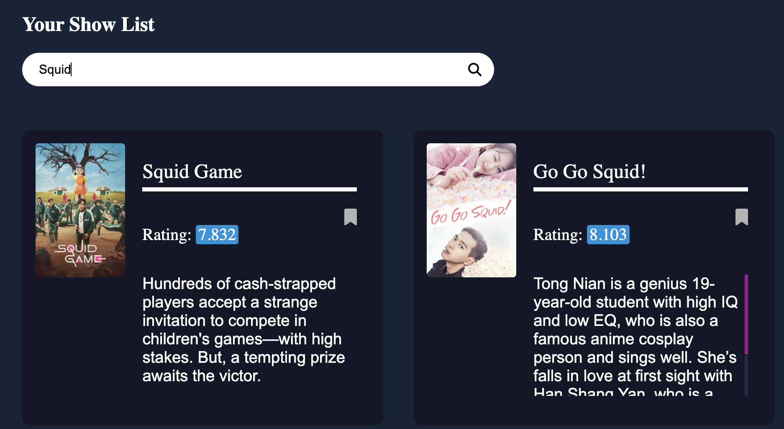

# PIVERSE: Asian TV Show Tracker 
<br>
 
## 📽 TABLE OF CONTENTS
1. [Introduction](#introduction)
    - [Project Overview](#project-overview)
    - [Purpose](#purpose)
    - [Target User](#target-user)
2. [Development Process](#development-process)
    - [Planning](#planning)
    - [Technologies & Tools](#technologies-&-tools)
    - [Implementation](#implementation)
3. [Key Features Iterations & Challenges](#key-features-iterations-&-challenges)
4. [Application Stucture](#application-structure)
5. [Setup & Configuration](#setup-&-configuration)
    - [Prerequisites](#prerequisites)
    - [Installation Instructions](#installation-instructions)
    - [Implementation](#running-the-application-instructions)
6. [Future Scope](#future-scope)
7. [References](#references)

<!-- SECTION BREAK -->
<br> 

---

<br> 
<!-- SECTION BREAK -->

## 📽 INTRODUCTION
<br>

### 🔸 <u>Project Overview:</u> 🔸
This is a Web Application that enables users to interact with an API from The MovieDB to display Asian TV Shows. This application allows users to bookmark their favourite shows to a personalised list, and keeps track of their viewing times with a statistical graph that is updated monthly. The app uses JavaScript, HTML and CSS for frontend, Node.js for server-side operations, and relies on the API for its backend data.

### 🔸 <u>Purpose:</u> 🔸
This application streamlines the viewing journey of Asian drama enthusiasts with a centralized, user-friendly tracking platform. It retains a comprehensive record of their TV consumption, aiding reflection on preferences and facilitating the discovery of new favorite shows.

### 🔸 <u>Target User:</u> 🔸
This application caters to the diverse range of Asian TV show viewers, ranging from avid fans to casual viewers, aged 15 to 35. 

<!-- SECTION BREAK -->
<br> 

---

<br> 
<!-- SECTION BREAK -->

## 📽 DEVELOPMENT PROCESS
<!-- Documentation of the development process, design decisions, iterations, improvements, and lessons learned... -->
<br> 

### 🔸 <u>Planning</u> 🔸
| Planning Steps | Descriptions |  Planning Image |
| :-----         | :----------- | :------------:  |
| <mark>Project Context Identification</mark> | Providing a clear purpose, defining the target audience, and establishing goals for the media-consumption tracking web application. This will ensure alignment among stakeholders and serves as a reference point for maintaining project direction. |  |
| <mark>Data Model</mark> | Data Model table laid out all the properties and attributes my application woudld handle. This helped the visualisation of my data needs and informed my database integration decisions. |  |
| <mark>Information Architecture</mark> | The IA encapsulates the structure and organisation of the website content which was crucial in creating logical navigation for users. Thus, it helps to ensure the website will be intuitive and user-friendly. |  |
| <mark>Concept Ideation & Branding</mark> | Initial paper & digital sketches were made to define my concept. A branding guidline were also made for the color palette and typography ot maintain consistent aesthetics. |    |
| <mark>Wireframes</mark> | Annotated wireframes mapped out the proposed application layout, clarifying element placement and interaction.|  |
| <mark>Prototyping</mark> | Built on the wireframes, the prototypes intergrated all previous intended web page structure, intended styles, aesthetics and functionality annotations, providing a near-final visual representation of my application.  |  |

<br> 

### 🔸 <u>Technologies & Tools</u> 🔸
| Tech / Tools | Logo        |  Selection Justification |
| :-----      | :---------:  | :------------            |
| <mark>HyperTextMarkUp Language</mark> |  | HTML is the standard markup language used in creating web pages and has widespread support across all modern browsers. It provides the structure and content of my web pages, including but not limited to text, images, and links. |
| <mark>Cascading Style Sheets</mark> |  | CSS is used alongside HTML to style the web page. It allows me to control the layout, colour and fonts on my webpage. CSS enhances user experience by making the web app visually engaging and user-friendly. |
| <mark>JavaScript</mark> |  | JS is essential to create dynamic and interactive webpages. It allows me to manipulate the respond to user actions like button clicks, fetch API data and storing localStorage data. |
| <mark>Node.js</mark> |  | Node.js is the server-side platform used for its advantages of having the same language as the client-side, ultimately makes development more streamlined. Node.js is also efficient and lightweight so the web app can handle multiple client requests concurrently. | 
| <mark>Plotly.js</mark> |  | Plotly.js was chosen for creating data visualisation due to its compatibility with the JavaScript ecosystem  and capability of multipled type of graphs generations. |
| <mark>TheMovieDb</mark> |  | TMDb is an extensive movie database that offers a comprehensive API for fetching a wide variety fo TV Show data. It allows free access to details like movie cast, ratings and images which are vital info for my web app. |

<br> 

### 🔸 <u>Implementations</u> 🔸
<br>

After the planning process, I proceeded to the implementation phases:

| Phases | Description  | 
| :-----| :---------   | 
| <mark>1. Setting Up the Environment</mark> | - Initialised the project with `npm init` <br>- Created `package.json` file to manage project dependencies. <br>- Set up main server file `server.js`, using `Express.js` - a `Node.js` framework to handle routes & error handling efficiently.<br>- Implement the `Plotly.js` library. |
| <mark>2. Version Control & Collaboration |  - Initialised a Git repository to track project changes for a clear history. <br>-  Code was committed and pushed to GitHub after every major changes to the key features *(more below)*, as a backup and collaboration platform. |
| <mark>3. Backend Development | - Crafted the necessary server-side logic using `Node.js` to handle requests & responses. <br>- Generate a unique API key from TMDb and fetch data of tv shows filtered specifically from the regions within Asia.|
| <mark>4. Frontend Development | - Crafted the UI of the web application using HTML, CSS and JavaScript based off of the final prototype. |
| <mark>5. Data Visualisation | -  Crafted the multiple line graph suitable for user tracking needs using `Plotly.js` (currently static data for future developers) |
| <mark>6. Responsive Design | - Updated the frontend to ensure the application is responsive and provide an optimal viewing experience across a range of screen sizes. |
| <mark>7. Testing & Iterations | - Continous testings of the functionalities over different screen sizes and iterate to resolve issues and improve its usability *(more below)* |


<!-- SECTION BREAK -->
<br> 

---

<br> 
<!-- SECTION BREAK -->

## 📽 KEY FEATURES ITERATIONS & CHALLENGES

<br> 

#### <mark>**Feature #1: Fetch Data from API**</mark>: The application fetches TV shows data from TheMovieDB API using the fetch() method. The JSON data is then parsed, and the relevant parts are extracted and displayed on the page.
| Problem Faced | Before (Iteration #1) | Solution | After (Iteration #2) |
| :-----------  | :------------------:  | :------- | :------------------: |
| Struggled with obtaining the API key due to unfamiliarity with different database requirements and login procedures, which proved to be time-consuming.  | N/A |  Enhanced understanding and proficiency by repeatedly viewing various YouTube tutorials on fetching API keys with TMDb and consulting the TMDb API documentation. As a result, I was able to filter data by customising on the link. |   |
<br>

#### <mark>**Feature #2: Search Shows**</mark>: The web app allows users to search for their favorite shows through the fetched API using a search input box. 
| Problem Faced | Before (Iteration #1) | Solution | After (Iteration #2) |
| :-----------  | :------------------:  | :------- | :------------------: |
| The search function returned too many results or irrelevant results, outside of the Asian TV Show scope.  | N/A |  To refine the search function, I customised the API link to include additional filters, like 'tv', thus narrowing down the search results. I also declared a function to filter TV shows based on the listed countries, providing more relevant content to users. |  |
<br>

#### <mark>**Feature #3: Bookmark Shows**</mark>: Users can bookmark their favorite shows to a personalized list called "Your Collection". The application stores the list locally using the localStorage object in JavaScript.
| Problem Faced | Before (Iteration #1) | Solution | After (Iteration #2) |
| :-----------  | :------------------:  | :------- | :------------------: |
| Weren't able to edit the style of the bookmarked shows that appeared in the 'Your Collection' section, leading to unreadable text.  |  |  *Not Yet Solved* | N/A |
<br>

#### <mark>**Feature #4: Review Shows**</mark>: Users can click on the "+Add Review" button to open a pop-up form to add new review of their watched TV shows.
| Problem Faced | Before (Iteration #1) | Solution | After (Iteration #2) |
| :-----------  | :------------------:  | :------- | :------------------: |
| Initially, the form were supposed to be for user to input show's detail to search for shows by fetching API (not the search bar), howevever, I weren't able to ustilise the form's user input to fetch the API and add additional review/comments into it at the same time. | N/A |  Incoporated a search bar, which the TMDb APi documentation provided details on how to fetch API through a search bar using individual key number. And the form changed to handle user input for reviews/comments only. | 
<br>

#### <mark>**Feature #5: Delete Reviews**</mark>: User can delete their reviews with the "Delete" button.
| Problem Faced | Before (Iteration #1) | Solution | After (Iteration #2) |
| :-----------  | :------------------:  | :------- | :------------------: |
| 'Delete' button does deleted the review until user refresh their page, which means the review is still stored in the localStorage | N/A | *Not Yet Solved*. The Review inputs are stored in the same storage as the bookmarked shows due to previous attempts towards a different type of functionality. This created more complications for me to resolve. | N/A |
<br>

#### <mark>**Feature #6: Show Tracking Graph**</mark>: Uses the Plotly.js library to plot the users' monthly watch time for different category of Asian TV shows (e.g. Korean Drama, Thai Drama, etc...) using a multiple line graph.
| Problem Faced | Before (Iteration #1) | Solution | After (Iteration #2) |
| :-----------  | :------------------:  | :------- | :------------------: |
| The graph was not powered by actual user data and was too small to view effectively in the side section. |  |  To enhance the graph, I updated it with plausible static data representing various TV show categories for future development. Also, the graph was made expandable to increase the visibility and comprehension of the presented statistics. |  |
<br>

<!-- SECTION BREAK -->
<br> 

---

<br> 
<!-- SECTION BREAK -->

## 📽 APPLICATION STRUCTURE
<!-- Explanation of the project structure...
(Outline the architecture of your project. Explain how all the pieces fit together and how the directories and files are organized.) -->
```
├── public/                    # directory contains all the files publicly accessible
│   ├── images/                # image folder containing all the media files
│   ├── index.html             # HTML file for the main page
│   ├── style.css              # CSS file for styling
│   └── script.js              # client-side JavaScript code
├── .gitignore                 # tells Git which files or folders to ignore in the project.
├── package-lock.json          # Auto generated for any operations where npm modifies 
├── package.json               # hold various metadata relevant to the project
├── server.js                  # the Node.js server file
├── README.md                  # documentation file (you are reading this file!)
└── node_modules/              # the directory where npm packages are stored
```

<!-- SECTION BREAK -->
<br> 

---

<br> 
<!-- SECTION BREAK -->

## 📽 SETUP & CONFIGURATION
<!-- (This section will guide the reader on how to set up the project on their local machine for development and testing purposes.) -->
<br> 

### 🔸 <u>Prerequisites</u> 🔸
<!-- List any requirements for running your application (Node.js version, etc). -->
Before using the web app, ensure that these requirements are met:

- **Node.js**: You will need Node.js installed on your machine to run this application. I have used Node.js version 14.x for this project, so make sure your Node.js version is compatible.
  > ⚠️ *If you don't have Node.js installed yet, download it from: [Node.js Offical Website](https://nodejs.org/)*

- **npm**: Node Package Manager (npm) is distributed with Node.js, which means that when you download Node.js, you automatically get npm installed on your computer. Ensure you have npm installed to manage the project dependencies.

- **Express.js**: The server for this application uses Express.js version 4.18.2, a popular web application framework for Node.js. Express.js will be installed as a part of the npm installation process.

- **A modern web browser**: The application is designed to work on modern web browsers like Chrome, Firefox, Safari, or Edge.

- **Git**: Our version control system is Git. You will need Git installed on your computer to clone the project repository.
  > ⚠️ *Read the installation instructions below if you don't know how to download repository from Github*

- **Access to TheMovieDb API**: This application uses TheMovieDb API for movie data. You will need to sign up on TheMovieDb's website and generate your own API key. <u>Example of my API</u>:
   - `GET https://api.themoviedb.org/3/movie/550?api_key=6f0b2683b85ef3e1a6c84e9227158c71` to fetch general movie data.
   - `GET https://api.themoviedb.org/3/discover/tv?sort_by-popularity.desc&api_key=6f0b2683b85ef3e1a6c84e9227158c71` to fetch Asian TV show data sorted by popularity.
   - `GET https://api.themoviedb.org/3/search/tv?&api_key=6f0b2683b85ef3e1a6c84e9227158c71&page=1&query={query}` to search for TV shows.

<br> 

### 🔸 <u>Installation Instructions</u> 🔸
<!-- Instructions on how to use the application...
(This section provides instructions on how to use your application, including screenshots or even video clips demonstrating the application in use.) -->
There are 2 ways to download the repository from GitHub:

1. **Download as a ZIP file**: Navigate to the main page of the repository on GitHub, click the "Code" button, and then click "Download ZIP". You will then extract the ZIP file to access the project files.<br>


2. **Clone with Git**: Alternatively, if you have Git installed on your device, you can log the following command into your terminal: 
   ```
    git clone https://github.com/mngu0713/mngu0713-tracker.git
   ```
<br> 

### 🔸 <u>Running the Application Instructions</u> 🔸
After downloading or cloning the repository, continue with these steps in your terminal:

1. **Navigate to the project directory using the command:**
   ```
   cd mngu0713-tracker
   ```
2. **Install the necessary packages:**
   ```
   npm install
   ```
3. **Start the server:**
   ```
   node server.js
   ```
4. **Access the application:** The web application is now accessible at http://localhost:8888 in your web browser. 

<!-- SECTION BREAK -->
<br> 

---

<br> 
<!-- SECTION BREAK -->

## 📽 FUTURE SCOPE
<!-- Discussion of future improvements and features...
(In this section, you should discuss what could be done to extend the application's functionality in the future, and any limitations currently present that you would like to address. This demonstrates your forward-thinking and your understanding of the app's potential.) -->

**Bookmarking & Reviewing Function Improvements** 💎
   Streamline the bookmark and review process to allow users to comment on newly bookmarked shows instantly, mitigating the need to manually complete a form every time they want to review. This improvement can be achieved by integrating modal forms or pop-ups upon bookmarking.

**Enhanced Bookmarked Collection List Categorization** 💎
   Extend the bookmarking feature to include status updates like 'Not Started', 'Watching', 'Paused', and 'Completed', enabling users to more accurately track their viewing progress (like what was proposed in A2). This could be implemented using dropdown menus or radio buttons for user convenience.

**Enhanced User Experience for Form Review** 💎
  Implement an intuitive coding solution that offers title suggestions from previously saved shows, accommodating users who might not recall specific titles. Further, include a safeguard parameter in the code to prevent multiple review entries for the same show.

**LocalStorage Enhancement** 💎
   Implement editable fields in LocalStorage to allow users to modify their reviews, ratings, etc., post-bookmarking. This could involve creating an 'Edit' button next to each LocalStorage item that loads the existing data into an editable form.

**Fallback Updates** 💎
   Develop a more robust fallback strategy for users to manually input TV shows that are not available in the database. This could involve a user-friendly form and a process to validate and store user-generated data securely.

**API Source Expansion** 💎
   Explore APIs that include a wider range of Asian shows to enhance the user experience for our Asian TV Show enthusiast demographic. This requires evaluating multiple API options for content availability, reliability, and ease of integration.

**Interactive Plot Update** 💎 
   Incorporate more interactive features to offer flexibility in how users plan and track their TV show consumption.
   💎 Enhance the plot to dynamically respond to user's data inputs, transitioning from static to dynamic data visualization. This could involve using advanced libraries like D3.js for interactive, data-driven visualizations.

**Improve User Interface** 💎 
  Develop more sophisticated CSS to enhance the current visual aesthetic, aligning it more closely with the proposed designs in the final mockups.


<!-- SECTION BREAK -->
<br> 

---

<br> 
<!-- SECTION BREAK -->


## 📽 REFERENCES
<br>

Font Awesome. (2023). *Home page*. Retrieved from https://fontawesome.com/

Layoutit!. (2023). *CSS Grid Layout Generator*. Retrieved from https://grid.layoutit.com/

University of Sydney. (n.d.). *DECO2017 - Week 5 Tutorial Content*. Retrieved from USYD Canva.

Dongas R. (2023). *Univeristy of Sydney: Week 4 DECO2017 Tutorial*. Scrimba. Retrieved from https://scrimba.com/scrim/coa064ba08c96c1639bc9531b

Rana, M. (n.d.). *Movie app list searching api project using javascript* [Video]. YouTube. Retrieved from https://www.youtube.com/watch?v=8q5T1rFtRoE

The Movie Database. (n.d.). *API Source for TV Shows Data*. Retrieved from https://www.themoviedb.org/settings/api

Dongas R. (2023). *Univeristy of Sydney: Week 10 DECO2017 Tutorial*. Scrimba. Retrieved from https://scrimba.com/scrim/c7L6ZGC8